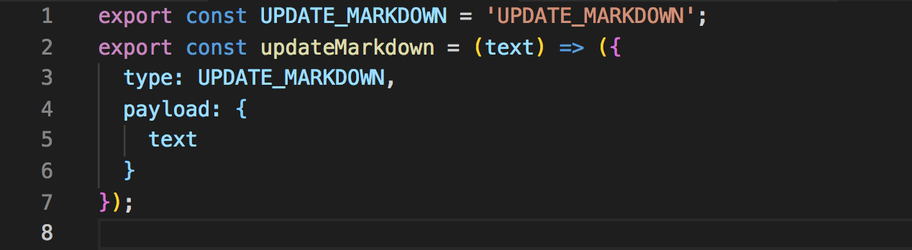
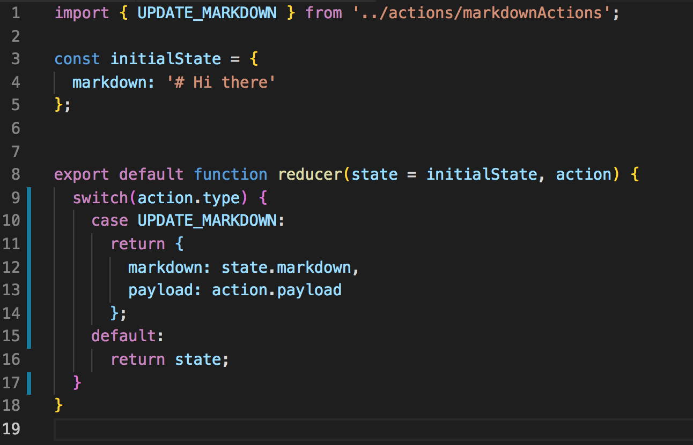

Alright, so today I was introduced to redux and all the attractive functionality that comes with it. The next few posts be an in-depth dive into one component of redux. Today it is actions and action creators. 

So what is an action in redux? Well, actions are functions that are used to perform some sort of activity on an application`s store/state. They take a value that will be added to your store/state. Here An example below references how we used an action called 'UPDATE_MARKDOWN' to take note of the current value of a text box and assign it as a property in an object. 

An action(which contains the new piece of data or at least references it) gets passed into a (usually) a switch state and updates your application`s store/state based on the actions. In our example, it updates the current markdown file.

Actions Vs. Action Creators

Actions are 'payloads' of information that get sent from your application to your store component. Essentially, they are the item that gets updated in your applications store. 

On the other side, we have Actions Creators, which as they sound are functions that create Reduce actions.  For example, on a button click you might want to add a piece of information to your store. So by having a function that creates an action on a button click, you have created the foundation of redux in your hands. 