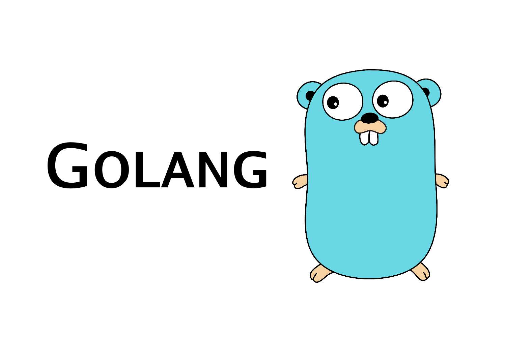

All right I figured now is probably a good time to write about my experience with Golang. I'm working on my third? application using Golang. The first one was a simple API that allows endpoints to be hit and return some data or do a POST and place some data while the server was running. Pretty basic and straight forward using a few tutorials and packages I found online. The second project was converting that API to use a MongoDB instance so the data can persist. Right now the only thing I can do is post data because I haven't figured out how to query the DB using Golang and decoding it back from bytes into JSON. The third project I did was a 'password cracker'. Essentially, given a hashed password, I loop through the top 10 million passwords, hash them and compare each one to the given hashed password. I had tons of fun writing this program because it was a great example of Go's concurrent features and how worker pools can be used. I also heard about works and various other terms reference with Docker or K8 so it was a nice intro into what that's all about. 

What do I like about Golang?

It can be statically or dynamically typed.
Folders allow the creation of packages.
Capitalized functions names make them globally exportable.
Pointers are cool.
You can have multiple returns from a function.

Things I don't like yet...

I don't know when to define a slice on the fly or create an instance of one.
Understanding structs? Are they like JS objects? does Golang have a direct equivalent of an object?
Everything I don't like is basically the things I'm not comfortable with and stuff I lack understanding of. 

[Heres a link to my Go API.](https://github.com/Zilula/goApi)