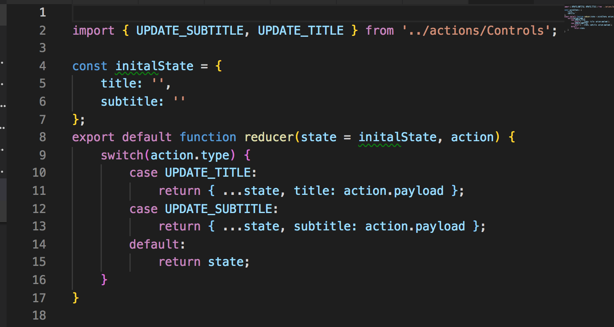
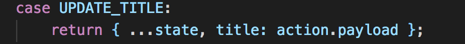
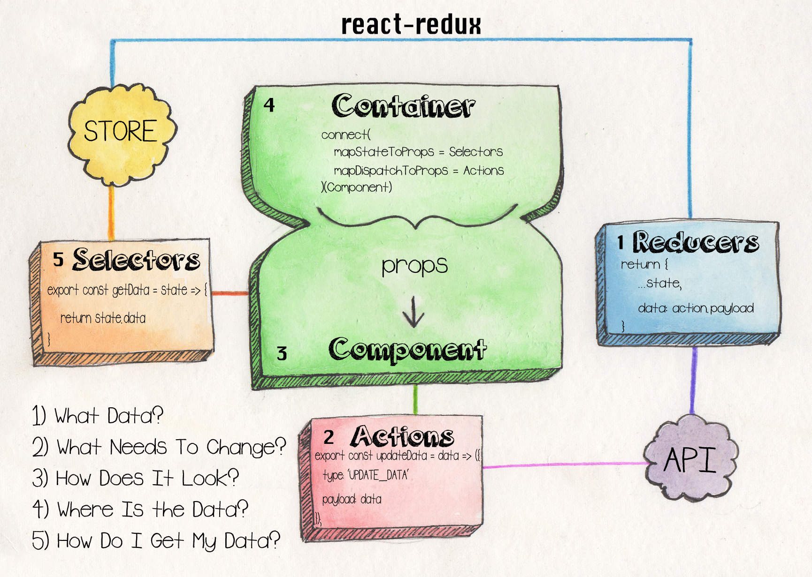

The last piece of most redux applications is out reducer. Our reducer isn't as self-explanatory as an action is but is not all that complicated either. When it comes down to it, a reducer listens for action and performs some sort of functionality based on each action.  

Its most common to use a switch state(per the redux docs) but any sort of conditional logic would probably work. I say probably because I've only ever used redux with a switch. A bunch of if blocks could totally work though if that's your jive.  Soo in this application we have two actions and two pieces of state that change upon user input, the title, and subtitle fields.  Out reducers listens for one of those actions and updates our state/store object accordingly. 

If a 'UPDATE_TITLE' action gets fired we spread out state object into a new object and update the title with the action`s payload, which holds the new title. 

The same logic applies to update the subtitle. Finally, we add a default case to return our current state in case we get passed an action that we haven't accounted for.

![subtitle]'./subtitle.png)

This default case allows for the preservation of our state and prevents it from being reset or lost because of a bug or something. 

Okay so all these small parts separately are fine and dandy but what does the big picture look like? This beautifully drawn image of the react-redux lifecycle illustrates how each component flows together. There are also numbers labels the sequence one might take when building a react-redux application. 

Kate is an amazing artist who drew this and other helpful code images. Check out her twitter here. 

[Kate`s Twitter](https://twitter.com/katerj)
