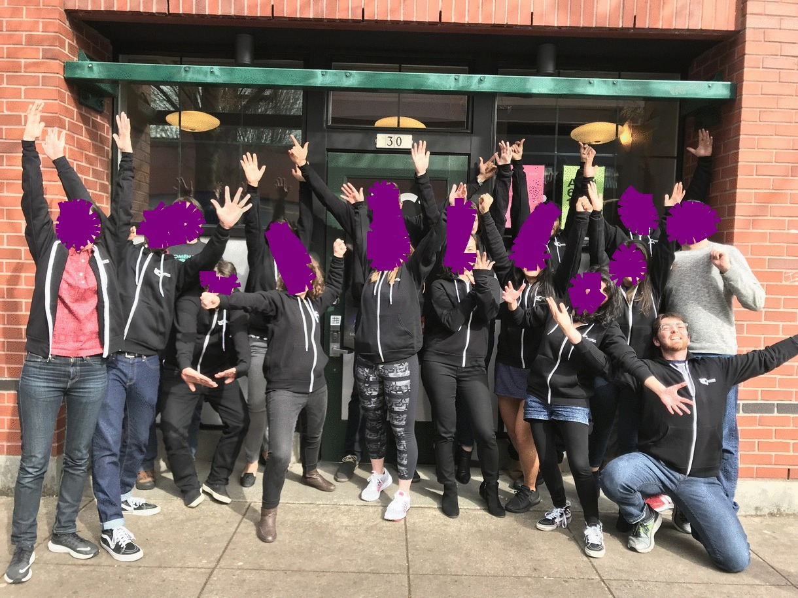

What is up people who read my blog??? There probably isn't many of you but I appreciate it none the less. I've had a busy few weeks. About three weeks to be exact. They have been crazy and filled with emotion? Frustration Fun? Anxiety?  Everything? Yea its been three weeks of everything. I've been fortunate enough to finish Alchemy Code Lab's Bootcamp and Career track program which essentially took me from zero to hero in coding. I am beyond thankful for all the staff and program faculty, like the Directors Marty and Megan, and Lead instructor Ryan. Additionally, my fellow students who I`ve come to know over the course of the last 6 months. Thank you. 

The staff and my cohort are the reason I am where I am. Without them, there is no way I could have completed the program or even learn as much as I have in such a short period of time. #respectTheHoodie YEAAAAA BOIIIIIIIIII. Alright, that's all I really have there.

But what's next? well? I got offered a job at Alchemy to TA for the incoming Bootcamp, which I'm incredibly grateful for(bless). This position keeps me around code while I sharpen my skills and start the job hunt. But aside from that? I STILL plan on writing that article about Auth0. I'll probably write it after/ in conjunction with a new app so that its fresh in my brain. 

Since I'd like a backend or full-stack position I've begun AWS training using ACloudGuru. I hope to take the Cloud practitioner exam by April 18th. And the AWS associate exam by the end of May. 

Alright, Peace out. 