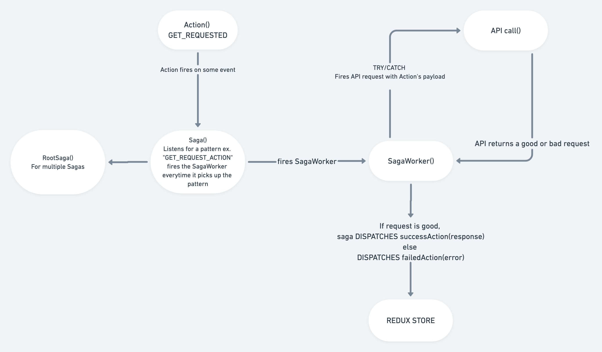
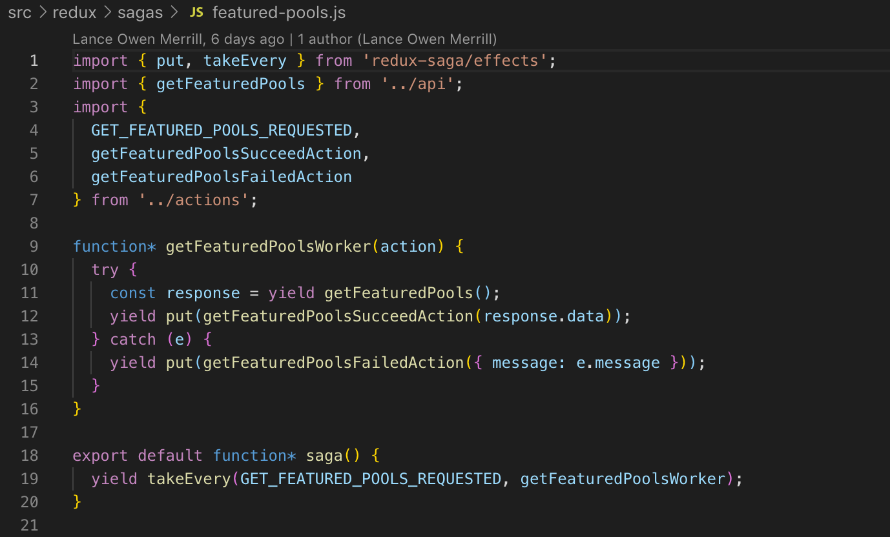

All right so with my start at Play Balto, the front-end react/redux code uses Saga middleware instead of the more common or simple Thunk middleware. This was my first time working with more than 1 type middleware to handle async redux actions. 

So what are Sagas? And how do they compare to Thunk middleware? Well at their core they do the same thing. Manage async functions in redux and handle side effects in some manner. The difference being that Sagas use generator functions and Thunk use promises which are more familiar to developers (yay JS). Generator functions are functions that when invoked return a value and iterable which can be invoked again allow you to get the next value that the function would return. Thunk makes you handle side effects on your own. Additionally, Sagas and Thunk can co-exist in a project, but I haven't run into a case where you'd want to use both. Heres a sick little stack overflow article that mentions the difference between the two.

[Stack Overflow article](https://stackoverflow.com/questions/50285972/what-is-the-difference-between-redux-thunk-and-redux-saga)

 While they're similar to implement, they don't scale as nicely with complex data, UI/UX and so on. Below is a little flow chart that explains the life cycle that redux takes when using Sagas.
 

And here's a code snippet of what a saga might look like for a given redux action. Pretty basic but should give you enough context for why you might want to use them.

