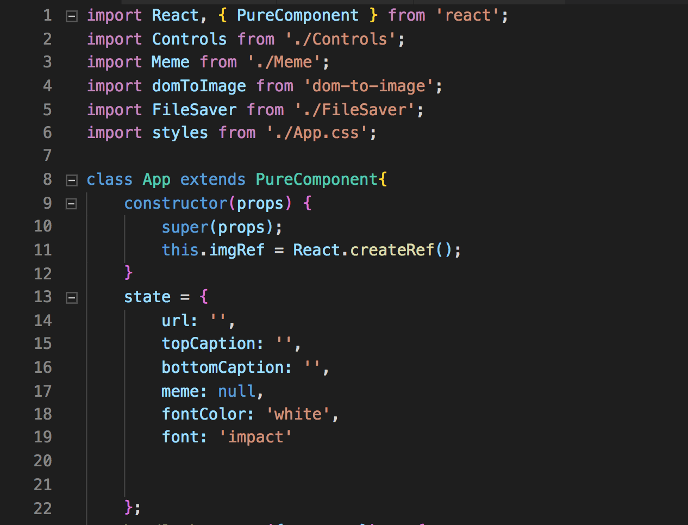
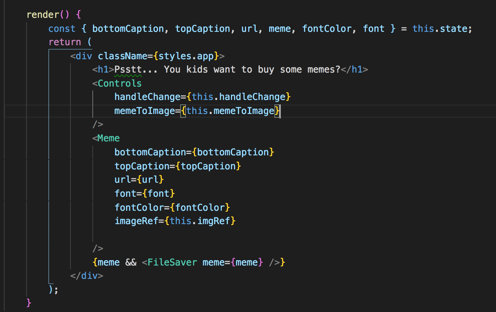
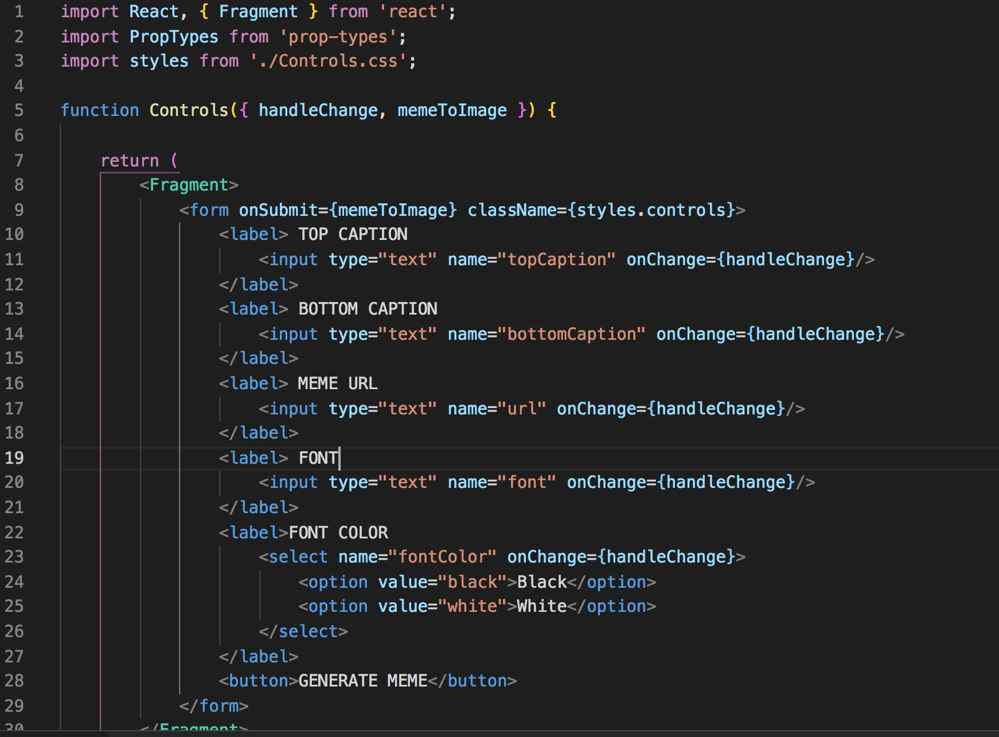

What do you meme?

This past week I dove head first into react. With so much hype around Facebook`s development prodigy, I thought it would be much shinier. But so far that hasn't been the case. Coming from a background in Vue, where a single file has it's own template, JavaScript and Style tag for that component, react is largely different. In react your HTML, CSS and JS are all intertwined in a single file which is wholely JS or JSX. Also??? Everything in react is a class? I guess that's a thing. No problems working with classes but thought it was a point worth noting. 

There is a lot of division within the react community(from what I gather via random people`s very opinionated blog). Some people really love the react class-based components and abandon everything that isn't one. You have your standard, functional component. You have a Pure component and just a normal react class component. And then there is state. Which is an entirely another beast. Contrary to what I might have said earlier, state IS very shiny and is crazy fun/useful. Reach allows you to control data and events from a central location (normally the parent of the situation) and feed new data and events down the chain to all the children so they may react(ha) accordingly. 

In the following bit of blog I`m going to (poorly) explain some basic concepts of React used to make a Meme Generator. 

Alright so first off we have this object called 'state' which as mentioned above is a to store all the different variables and their,well current state. Right now fontColor is default set to white, but there is an option/selector that allows the user to change the color to black. When the change is made, it fires a function called 'handleChange' which updates the appropriate state key and value. 

These state variables are then passed down during binding and prop drilling into child components where that child may then re-render using the updated props/data. 

Here we see a component called 'Controls' which contains a form that takes the various inputs that are needed to generate the meme. Font, captions, color, and URL. All of these have fire that function 'handleChange' as mentioned above to update the parent component`s state in instance of something changing the change. 

As the state in the parent component changes, any child components that are depend on the parent`s state update and re-render accordingly. There is a bit of a caveat to that (depends if the child component is a regular class component, pure class component or a functional component).

And thats all I have people. See ya next time.